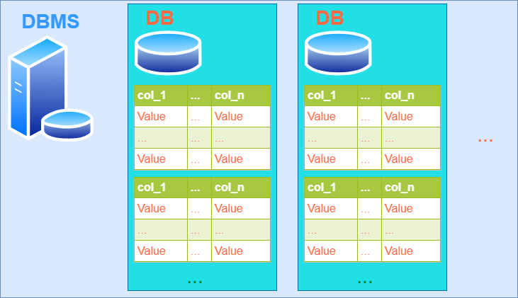

# MySQL 基础认知

> #### **Origin: Danfer Wang**

## MySQL的三层体系结构

### 第一层 存储引擎

主要由储存硬件和软件接口服务提供，包括储存引擎（InnoDB）、持久化存储介质（硬盘）、内存、网络等基础设施

### 第二层 SQL核心

是数据库服务提供业务的核心，查询解析、分析、优化、缓存、内置函数，主要包括以下模块：

- 连接/线程处理：通过端口，提供应用程序与MySQL服务的接口；同时，MySQL服务器侧可以处理多连接多线程的实时需求
- 解析器：解析由客户端应用程序传来的SQL语句，直观上，将SQL转化为底层查询代码（C/C++）。通常情况下，解析器前还有预处理器。
- 缓存器（查询缓存）：提供多线程处理和解析任务所需要的高速缓存
- 优化器：核心执行查询操作的模块，通过查询特征或用户指令（高阶查询优化），自动地优化查询。**此环节是核心中的核心，SQL学习的精华在此！**

### 第三层 应用程序

在图中是客户端，是用户通过交互软件（mysql，mysqlShell，Navicat，DataGrip等）操作管理MySQL数据库和编写SQL语句的前端。它们通过SQL核心层所暴露的端口与MySQL服务交互命令和数据


*<!--图源：https://blog.tangdongsheng.com/478/-->*

##  MySQL的三层使用结构

不仅仅是MySQL，几乎所有数据库管理系统都是相同的三层使用结构

### 第一层： DBMS

数据库管理系统，监听默认3306端口，与客户端包括命令行、Navicat、Java交互

### 第二层： Database

数据库是数据库管理系统中的对象，一个DBMS中可以包括多个DB

### 第三层： Table

表是数据库中的储存方式与操作对象，包括创建schema、添加数据、增删改查等

**MySQL数据库-普通表的本质是文件**，在持久化存储介质（硬盘）中

表中：行row、列column

在Java中一行（记录），往往被创建为一个对象



## SQL语句分类

学习数据库实际上是学习管理数据库，使用SQL语句访问数据库，操作终端往往是Java或者是Python，使用Navicat是单纯方便数据库管理和SQL语句的使用。

- DDL： 数据定义语句 [create ...]

- DML： 数据操作语句 [insert ..., update ..., delete ...]

- DQL： 数据查询语句 [selete ...]

- DCL： 数据控制语句[管理数据库： 用户权限 grant..., revoke ...]

## 通过Java操作数据库

加载类，得到MySQL连接

```java
Class.forName("com.mysql.jdbc.Driver");
Connection connection = DriverManager.getConnection("jdbc:mysql://localhost:3306");
```

编写SQL语句

```java
String sql = "create ...";
```

得到statement对象，把SQL语句发送给MySQL的DBMS中执行

```java
Statement statement = connection.createStatement();
statement.executeUpdate(sql);
```

关闭连接

```java
statement.close();
connection.close();
```

